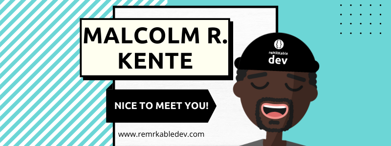

### Welcome / Karibu 👋🏾
I'm a Software Engineer/Developer (whichever floats your ⛵ ) passionate about learning and building things that bring value to people. Over time I've worked on a range of things, and the repos you'll find here reflect that. Apart from personal projects, you'll find some educational/instructional repos when I teach web dev at boot camps.

When I'm not coding, I'm probably working on my other creative interests (dance, music, poetry, etc.). A few years back, a couple of friends and I co-founded [Fuse Fam Collective](https://www.instagram.com/fusefamcollective/?hl=en) 🎭 .

### Some About Me's for You to Know

📍 I'm currently located in Amsterdam, NL.

🔭 I currently work as Engineering Manager at [AskPhill](https://www.askphill.com/).

🌱 I’m currently getting back to having fun with building small projects.

🥅  My goals for the upcoming year are: 
 - To keep building more when I can
 
🧑🏾‍💻 My weekly development towards my goals this year: 
 <!--START_SECTION:waka-->

```txt
JavaScript   1 hr 42 mins    ███████▓░░░░░░░░░░░░░░░░░   31.13 %
TypeScript   1 hr 39 mins    ███████▓░░░░░░░░░░░░░░░░░   30.20 %
JSON         1 hr 7 mins     █████░░░░░░░░░░░░░░░░░░░░   20.46 %
YAML         31 mins         ██▒░░░░░░░░░░░░░░░░░░░░░░   09.50 %
Other        23 mins         █▓░░░░░░░░░░░░░░░░░░░░░░░   07.09 %
```

<!--END_SECTION:waka-->

🤝  Connect with me on social media:

[](https://www.instagram.com/remrkabledev/)
[](https://www.facebook.com/remrkabledev)
[](https://www.youtube.com/channel/UCI1Z9YtIaqgffwgxnhyOlEg)
[](https://www.linkedin.com/in/malcolmkente/)
[](https://twitter.com/remrkabledev)

<br />

---
### Latest Blog Posts
<!-- BLOG-POST-LIST:START -->
- [Scrolling Text Animation With Funky Borders](https://dev.to/remrkabledev/scrolling-text-animation-with-funky-borders-4ckm)
- [Nesting Template Literals: A Recommended Approach](https://dev.to/remrkabledev/nesting-template-literals-a-recommended-approach-2jgj)
- [Testing with MongoDB-Memory-Server](https://dev.to/remrkabledev/testing-with-mongodb-memory-server-4ja2)
- [First Impressions &amp; Conversion Rates](https://dev.to/remrkabledev/first-impressions-conversion-rates-1b14)
- [Helper Functions for Assertions &lpar;Jest &amp; Node.js&rpar;](https://dev.to/remrkabledev/helper-functions-for-assertions-jest-node-js-3n11)
<!-- BLOG-POST-LIST:END -->

📝 [More blog posts...](https://dev.to/remrkabledev)


---
### Latest YouTube Videos
<!-- YOUTUBE:START -->
- [3 Basics of Web Development](https://www.youtube.com/watch?v=uYDoitJkcmM)
- [Learn HTML &amp; CSS part 3](https://www.youtube.com/watch?v=7JQd_xxX3ro)
- [Learn HTML &amp; CSS part 2](https://www.youtube.com/watch?v=BN0S3Tv7OnI)
- [Learn HTML &amp; CSS part 1](https://www.youtube.com/watch?v=mdcGxKY5nDo)
- [10 Reasons To Start Coding](https://www.youtube.com/watch?v=ejAMWoP8CDc)
<!-- YOUTUBE:END -->

🔔  [See more & subscribe...](https://www.youtube.com/channel/UCI1Z9YtIaqgffwgxnhyOlEg)


---
[](https://github.com/anuraghazra/github-readme-stats)


---
**Acknowledgements**

<sub>This layout structure is inspired by [codeSTACKr](https://github.com/codeSTACKr/codeSTACKr).</sub>

<sub>GitHub stats from repo [github-readme-stats](https://github.com/anuraghazra/github-readme-stats) by [Anurag Hazra](https://github.com/anuraghazra).</sub>

<sub>Weekly Wakatime Metrics from repo [waka-readme](https://github.com/athul/waka-readme) by [Athul](https://github.com/athul).</sub>

<!--
**reMRKableDev/reMRKableDev** is a ✨ _special_ ✨ repository because its `README.md` (this file) appears on your GitHub profile.

Here are some ideas to get you started:

- 🔭 I’m currently working on ...
- 🌱 I’m currently learning ...
- 👯 I’m looking to collaborate on ...
- 🤔 I’m looking for help with ...
- 💬 Ask me about ...
- 📫 How to reach me: ...
- 😄 Pronouns: ...
- ⚡ Fun fact: ...
-->
