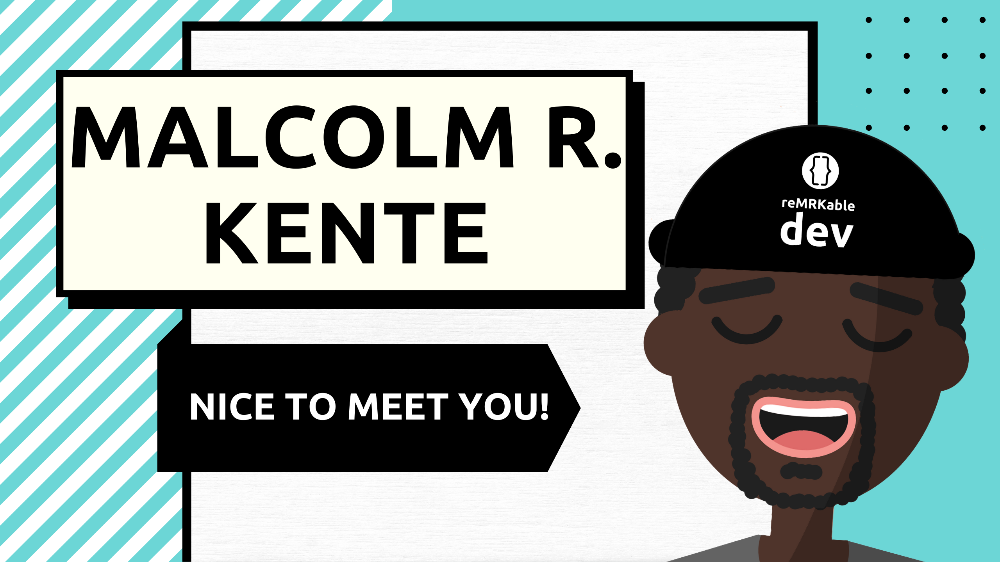

### Welcome / Karibu
I'm Software Engineer/Developer (whichever floats your ⛵ ) that's passionate about learning and building things that bring value to people. Overtime I've worked on a range of things and the repos you'll find here reflect that. Apart from personal projects, there some educational/instructional repos for when I teach web dev at boot camps. 

📍 I'm currently located in Amsterdam, NL

🔭 I’m currently working on:
 - A Proof Of Concept (POC) for a Node.js Learning Management System, 
 - An online tool for SoloPreneurs to start and run their businesses effectively (still in design phase),
 - An interactive map to help people see Amsterdam in a different light (working on POC currrently),

When I'm not coding, I'm probably working on my creative interests (dance, music, poetry, etc) 🎭

<!--
**reMRKableDev/reMRKableDev** is a ✨ _special_ ✨ repository because its `README.md` (this file) appears on your GitHub profile.

Here are some ideas to get you started:

- 🔭 I’m currently working on ...
- 🌱 I’m currently learning ...
- 👯 I’m looking to collaborate on ...
- 🤔 I’m looking for help with ...
- 💬 Ask me about ...
- 📫 How to reach me: ...
- 😄 Pronouns: ...
- ⚡ Fun fact: ...
-->
