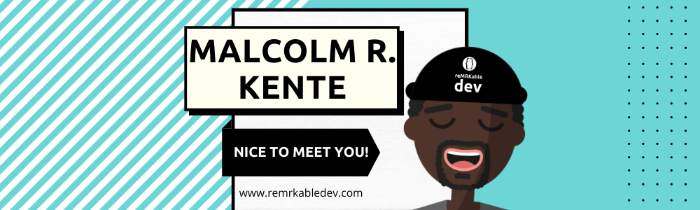

### Welcome / Karibu 
I'm a Software Engineer/Developer (whichever floats your ⛵ ) that's passionate about learning and building things that bring value to people. Overtime I've worked on a range of things and the repos you'll find here reflect that. Apart from personal projects, there some educational/instructional repos for when I teach web dev at boot camps. 

When I'm not coding, I'm most probably working on my other creative interests (dance, music, poetry, etc). A few years back, a couple friends and I co-founded [Fuse Fam Collective](https://www.fusefam.com/) 🎭 .

### Some About Me's for You to Know 

📍 I'm currently located in Amsterdam, NL.

🔭 I’m currently working on:
 - A Proof Of Concept (POC) for a Learning Management System made with Node.js & HBS, check it out [here](https://github.com/reMRKableDev/OnLearn).
 - An online tool for SoloPreneurs to start and run their businesses effectively (still in design phase).
 - An interactive map to help people see Amsterdam in a different light (working on POC currrently), check it out [here](https://github.com/reMRKableDev/a-livestory).

🌱 I’m currently learning TypeScript.

🥅  My goals for the upcoming year are: 
 - To finish off the projects I've started on.
 - To contribute more to Open Source Projects (still a bit intimidated by this to be honest 😋 ).
 - To have more proficiency in TypeScript.
 
🤝  Connect with me on social media:

 

---
### Latest YouTube Videos 
<!-- YOUTUBE:START -->
- [3 Basics of Web Development](https://www.youtube.com/watch?v=uYDoitJkcmM)
- [Learn HTML & CSS part 3](https://www.youtube.com/watch?v=7JQd_xxX3ro)
- [Learn HTML & CSS part 2](https://www.youtube.com/watch?v=BN0S3Tv7OnI)
- [Learn HTML & CSS part 1](https://www.youtube.com/watch?v=mdcGxKY5nDo)
- [10 Reasons To Start Coding](https://www.youtube.com/watch?v=ejAMWoP8CDc)
<!-- YOUTUBE:END -->

🔔  [See more & subscribe...](https://www.youtube.com/channel/UCI1Z9YtIaqgffwgxnhyOlEg)

---

---
**Acknowledgements**

This layout structure is inspired by [codeSTACKr](https://github.com/codeSTACKr/codeSTACKr)

GitHub stats from repo [github-readme-stats](https://github.com/anuraghazra/github-readme-stats) by [Anurag Hazra](https://github.com/anuraghazra)

<!--
**reMRKableDev/reMRKableDev** is a ✨ _special_ ✨ repository because its `README.md` (this file) appears on your GitHub profile.

Here are some ideas to get you started:

- 🔭 I’m currently working on ...
- 🌱 I’m currently learning ...
- 👯 I’m looking to collaborate on ...
- 🤔 I’m looking for help with ...
- 💬 Ask me about ...
- 📫 How to reach me: ...
- 😄 Pronouns: ...
- ⚡ Fun fact: ...
-->
